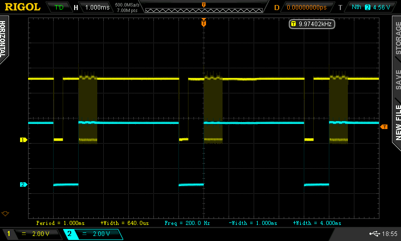
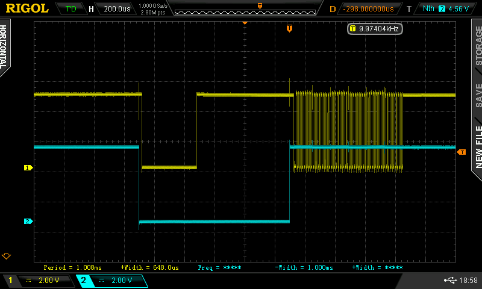
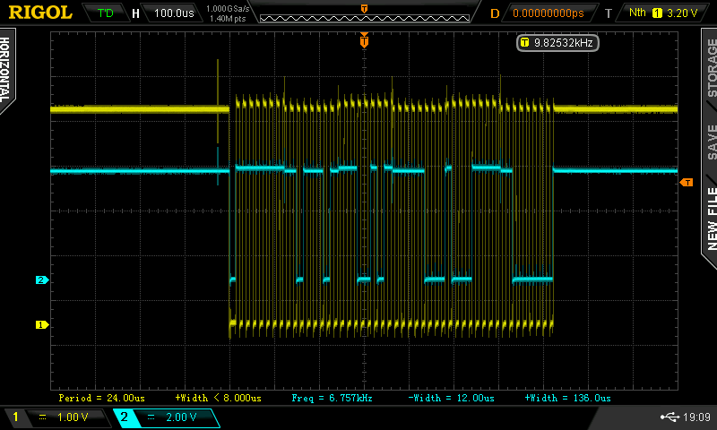
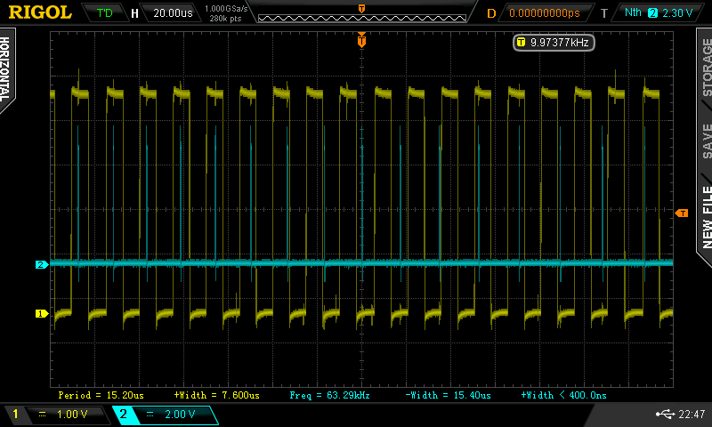

# AVR Interface to Microsoft SideWinder Gamecontrollers

Since the old days of gaming with a joystick (they have all vanished, do they?) I have an [Microsoft Sidewinder Precision Pro](http://en.wikipedia.org/wiki/Microsoft_SideWinder#Precision_Pro) lying around here. I plan on building a [Quadrocopter](http://en.wikipedia.org/wiki/Quadrocopter) soon and it seemed like the perfect device to control such a flying vehicle.

Reading through Google and Wikipedia I stumbled across [US Patent 5628686](patentimages.storage.googleapis.com/pdfs/US5628686.pdf) which is titled as "Apparatus and Method for bidirectional Data Communication in a Game Port" and explains a Method used to communicate digitally through a traditional analog-style Gameport. The explanations in that Patent were the Basis of my Experiments with the Device I have. I found them to not 100% match the reality but backed with all that Information I was able to reverse engeneer the Protocol used to talk to the "Precision Pro"-Joystick, analyze and use the received data.


## Hardware
Looking at the [Pinout of a Gameport](http://www.dstrom.de/ds/gameport.htm) we directly see the pins used to power the Gameport: 1, 8, 9 for VCC (5V) and 4, 5 for GND. After checking the Pins populated on the specific Device I have here, only the Pins 1 and 4 need to be connected to the respective voltage levels. As can be taken from the Patent, Pin 3 is the trigger used to request a data packet from the Joystick. Pins 2 and 7 are then used to transmit a clock and data back from the Joystick. The required Pins at a glance are:
```
 1 => VCC
 2 => Clock
 3 => Trigger
 4 => GND
 7 => Data
```
I used an [ArduinoMega](http://arduino.cc/de/Main/ArduinoBoardMega) to do my experiments but you can use all AVR Part with enough GPIO Pins. The Code in this Repo allows configuring the pinput to your needs. It contains everything needed to connect to a [KS0108](https://www.google.de/search?q=KS0108+lcd) comptatible 128x64 Pixel GLCD, visualizing the state of the Gamecontroller, as well as several timing signals used to measure the performance of different parts of the code using a Oscilloscope.


## Digital Interface
As described above, the MCU, after initializing its Ports & Pins, starts sending a Trigger-Pulse to the Gamecontroller. The Code in this Repo triggers a read every 5ms (at 200Hz). This can be seen in the following Graph, where the blue trace indicates the Trigger generated by the MCU and the yellow trace shows the Clock-Signal coming back from the Device.



Taking a closer look one can see some interesting things happening



When the Trigger-Line is pulled low by the MCU (the Joystick holds it high using a pullup), the Clock-Line dips a little. This would be recognized as an external Interval by my ATMega1280, which is why we need to disable the Interrupt before pulling the Clock-Line down. Just after that the Device also pulls its clock-Line low, possible signaling a busy-state. After about 400us the Device releases its Clock-Line to a high-State again, possibly signaling a ready-state. To be on the safe side this Code waits another 600us until it releases the trigger line. Soon after this the device starts sending Clock & Data signals (yellow and blue respectively in the following graphs).



When counting carefully, the device sends 48 bits of data (in the patent they speak about 64bits). The meaning of those bits has been reverse engeneerd and documents by the sw_data_t-struct in sidewinder.c. According to the Patent, each bit is valid on the rising edge of the clock.


As can be seen in the more detailed shot of that transmission, the bits are easily valid on the falling edge, too, but as we'll see later the ATMega1280 running on 16 MHz needs some tricks to keep up with that Clock, running at 66.6 kHz (~240 MCU-Clock-Cycles per Device-Clock-Cycle shoule be easily managable using Assembler, but getting it to work with C needed a little tweaking. I'm sure a AVR-C-Guru can point out some further optimisations).

You can use the CLKINDI-Pin (PH6 / Arduino Pin 9) to visualize the performance of your Clock Interrupt routine. Here is a shot of one of my first tries. It's easily visible how the Interrupt-Handler (blue) can't keep up with the Device-Clock (yellow) and misses some edges.



Read the next section to get an idea about why this happened and how it has been solved.


## Code Highlights
The Sidewinder-Trigger is produced using Timer/Comperator 1, because Timer 0 seems to be occupied somehow. It fires after 4ms, switchign from the ENABLE-state to the READING-state. In the Compare-Match-Interrupt, the Compare-Value is changed, so that after 1ms the timer fires again, this time switching back from READING- to ENABLE-state. Alltogether this forms a 200Hz loop, reading new data every 5ms from the Joystick.

This Code uses the external Interrupt INT5 to get into an Interrupt-Hanlder on each Device-Clock-Cycle. The MCU then reads a bit from Device and writes it into the RAM using the SETBIT-Macro which is basicly a bishift-1-and-or operation usually used in AVR-C-Code (aka `DDRB |= (1<<PB5)`). This is very fast, as long as the number of shifts required is constant and known at the compile-time.

The reason for this is, that the AVRs only have [sinlge-bit shift instructions](http://www.atmel.com/images/doc0856.pdf) implemented in hardware. When performing bit-shifts with constants, the C-Compiler optimizes the shift away and replaces it with an already shifted value (aka `DDRB |= 0b00010000`). But then the shift-value is not constanct (aka `DDRB |= (1<<x)`), the C-Compiler generates a loop, shifting an innocent 1 x times by one bit, until it has generated a adequate bit mask to OR with the register. This may be optimal from a code-size point of view, but it obviously comes with a tradeof in runtime. You can see the results in the graph showing the bad timing above:

```
if(BITSET(SW_DTA_PIN, SW_DTA_P))
	SETBIT(sw_dta.bits, sw_bitcnt); // this generates a loop, shifting a zero sw_bitcount-times to the left
```

Instead of letting the compiler generate a bulk-standard-solution which does not fit our use-case here, it's better to implement something more efficient ourselfs:

```
volatile uint8_t *byte = &sw_dta.bytes[sw_bitcnt / 8];

switch(sw_bitcnt % 8)
{
	case 0: SETBIT(*byte, 0); break;
	case 1: SETBIT(*byte, 1); break;
	case 2: SETBIT(*byte, 2); break;
	case 3: SETBIT(*byte, 3); break;
	case 4: SETBIT(*byte, 4); break;
	case 5: SETBIT(*byte, 5); break;
	case 6: SETBIT(*byte, 6); break;
	case 7: SETBIT(*byte, 7); break;
}
```

First we generate a pointer to one of our 6 data-bytes. Then we set the respective bit in that byte. The case generates a set of compares and conditional jump instructions, but for each cycle the number of actually executed instructions is relatively small compared to the massive shift-me-by-one-48-times loop we had before.

Both, the modulus of 8 and the division by 8 are relatively cheap instructions but they could be further optimized by using separate counters.

sw_dta.bytes is an array of 6x uint8_t types which exists in union with a struct. This struct controls how the individual bits received from the sidewinder-device are to be interpreted. This constellation of a struct and a byte-array in union allows to uses named members to access the different bits while keeping the ability to manipulate the data at the bit-level.


## Graphical Output
The ks0108-Routines are borrowd from [mikrocontroller.net](http://www.mikrocontroller.net/articles/KS0108_Library) and used to draw an image like the following onto the screen:


To optimize the refresh rate, only the parts that actually changed are redrawn. The Redraw-Rate varies between 160 Hz and 40 Hz, depending on the action you perform to the Joystick. The Painting-Routines are written in a way that should result in a mostly flicker-free display (The code tries not to erase everything and then repaint it, but instead only erase the parts that will actually be empty afterwards).


## Contact
If you have any questions just ask at peter@mazdermind.de or drop me a short line [https://alpha.app.net/MaZderMind](on ADN).
